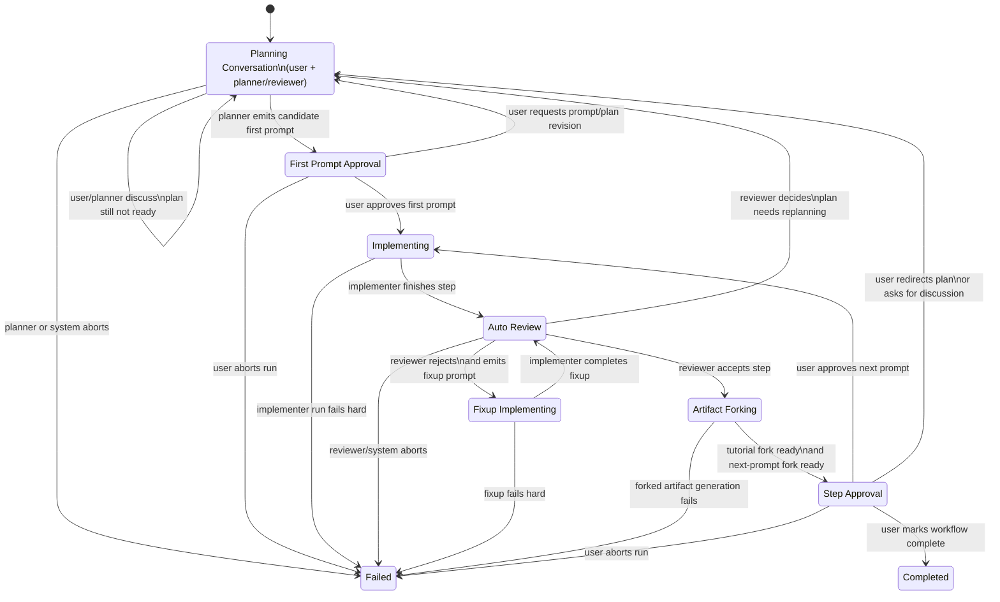
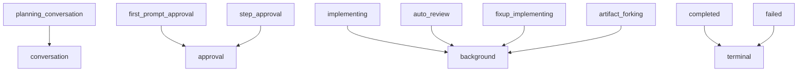

# Workflow DAG Sketch

This is a first-pass sketch of the `planner/reviewer + implementer` loop we discussed.

It separates:

- the concrete workflow states and transitions
- the higher-level user-facing state families:
  - `conversation`
  - `background`
  - `approval`

## State Diagram

## User-Facing State Families

These are not the real workflow states. They are just how the UI decides what should dominate.

## Implications For UI

- `planning_conversation`
  - planner/reviewer conversation should dominate
- `first_prompt_approval`
  - prompt approval packet should dominate
- `implementing`, `auto_review`, `fixup_implementing`, `artifact_forking`
  - graph/status view should dominate
  - session wall is the main deep-inspection mode
- `step_approval`
  - approval packet should dominate again
- `completed`, `failed`
  - summary / status outcome view should dominate

## Notes

- This is intentionally still one concrete workflow, not the generic workflow API yet.
- The important next step is to turn this into an explicit workflow definition model with:
  - states
  - transitions
  - active actors
  - open user gates
